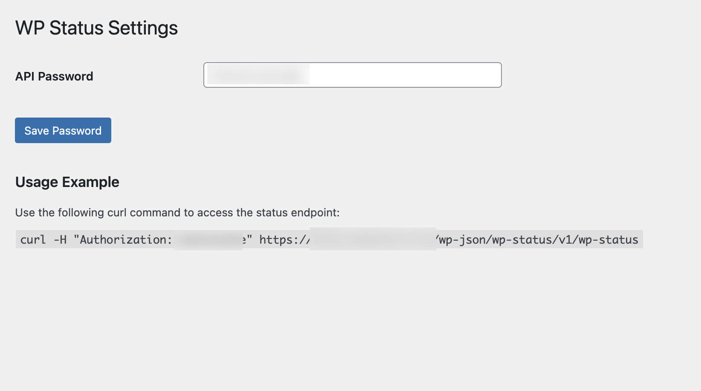

# WP Status

The WP Status plugin for Wordpress provides a status endpoint that can be used by automated monitoring systems to check the health and status of a Wordpress installation.

## Installation

### Automated

In your Wordpress site visit the plugins install page e.g.
https://mywordpresssite.com/wp-admin/plugin-install.php

Search for 'WP Status' and use the 'install' button.

### Manual Installation

The plugin can be manually installed by creating a directory in your wordpress site for the plugin i.e.

```
mkdir -p ./wp-content/plugins/wp-status
```

Then copy the file `wp-status.php` into that directory.

## Configuration

In the Wordpress Admin menu locate the 'WP Status' settings page under the 'Settings' menu.

In the settings page you can:

- set the password used to access the endpoint
- view an example curl command and address used to access the endpoint



## Testing

Test that your endpoint is working correctly by sending a curl request to the endpoint. An example is shown below that you can amend for your own web address:

```
curl -H "Authorization: yourpassword" https://yourwordpresssite.com/wp-json/wp-status/v1/wp-status
```

## Integration

The aim of WP Status is to be integrated into your existing monitoring systems. Some examples are provided below:

### Nagios

You can create your own Nagios check script to parse the content of the JSON provided by WP Status or use the `check_wp_status` file provided in this repo.
The check_wp_status binary can be downloaded from the Github Releases page or it can be compiled with:

```
cd integrations/nagios/check_wp_status
go build -o dist/check_wp_status
```

The binary produced in the `dist` folder can then be copied to your nagios installation e.g. /usr/lib/nagios/plugins/check_wp_status

### Munin

The wp_status binary can be downloaded from the Github Releases page or it can be compiled with:

```
cd integrations/munin/wp_status
go build -o dist/wp_status
```

The binary produced in the `dist` folder can then be copied to your munin installation e.g. /usr/share/munin/plugins/wp_status
